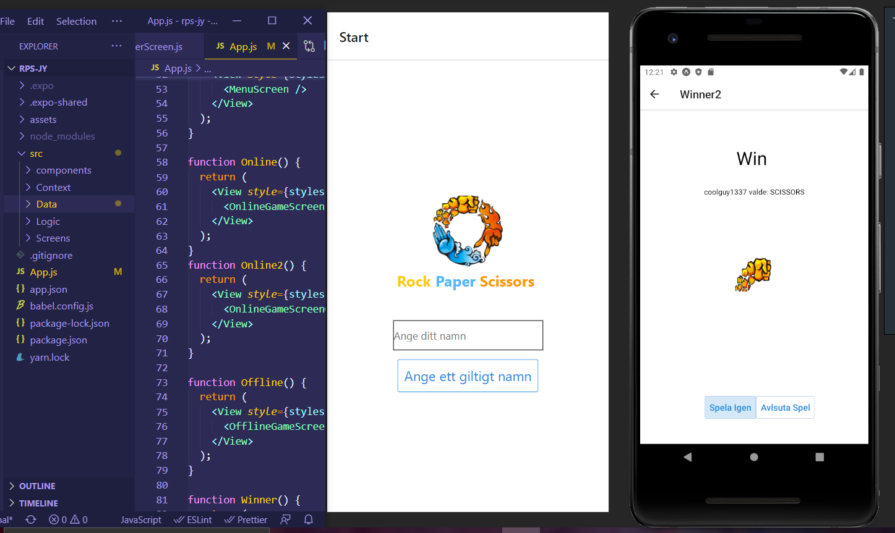

# rps-react-native





###
```
Rock, paper, scissors is an example of a zero-sum game without perfect information. 
Whenever one player wins, the other loses. We can express this game using a payoff matrix 
that explains what one player gains with each strategy the players use.
```


technologies: {

	frontend:
	-react-native
	-react hooks 
	-Higher-Order Component
	
	backend: 
	springboot
	jpa
  link: https://github.com/jakeHacker99/springboot-rps-java
	
	database: 
	-mySql
}


##
```
support: {browser, android and ios}
```
##
```
Authors:  {jakob yaro & yazan alkhouri}
```
